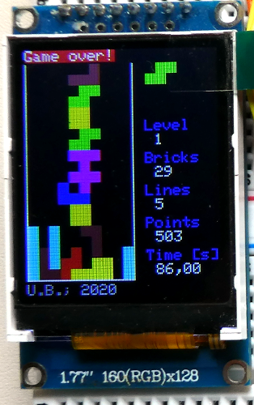

# Tetris-Konsole(n)

"Zufällig" lag ein [Mini-TFT-Display (1,77``; 160x128 Pixel; RGB)](https://www.az-delivery.de/products/1-77-zoll-spi-tft-display) auf dem Schreibtisch rum, die ideale Grundlage für eine kleine Tetris-Konsole.... Bei allen folgenden Versionen ist [meine Tetris-Implementierung](https://github.com/boerge42/tetris) der Grundstock. Die Basis für die Bibliothek zu Ansteuerung des TFTs wurde [hier](https://github.com/cpldcpu/uTFT-ST7735) gefunden.

Es entstanden zwei Varianten, die sich in der Art der Eingabesteuerung unterscheiden:

* [via Wii-Controller](tft_wii_controller)
* [via Mikro-Taster](tft_mikroswitch)

---------
Have fun!

Uwe Berger; 2020