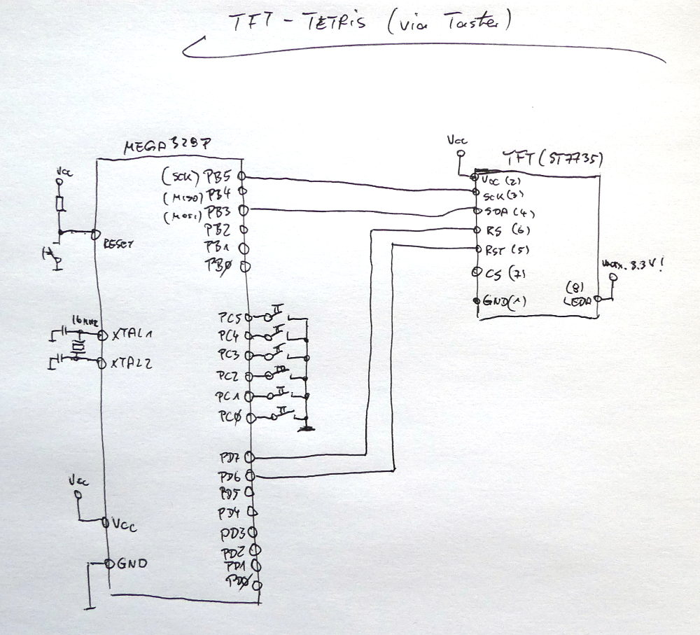

# Tetris-Konsole --> Steuerung via Mikro-Taster

...theoretisch passt dieser Code auch auf einen Mega8:

    avr-size tetris.hex
       text	   data	    bss	    dec	    hex	filename
        0	   7686	      0	   7686	   1e06	tetris.hex

Schaltplan:

Aufbau auf einem Breadboard (und einem Arduino Nano; ...Mega328P):

---------
Have fun!

Uwe Berger; 2020