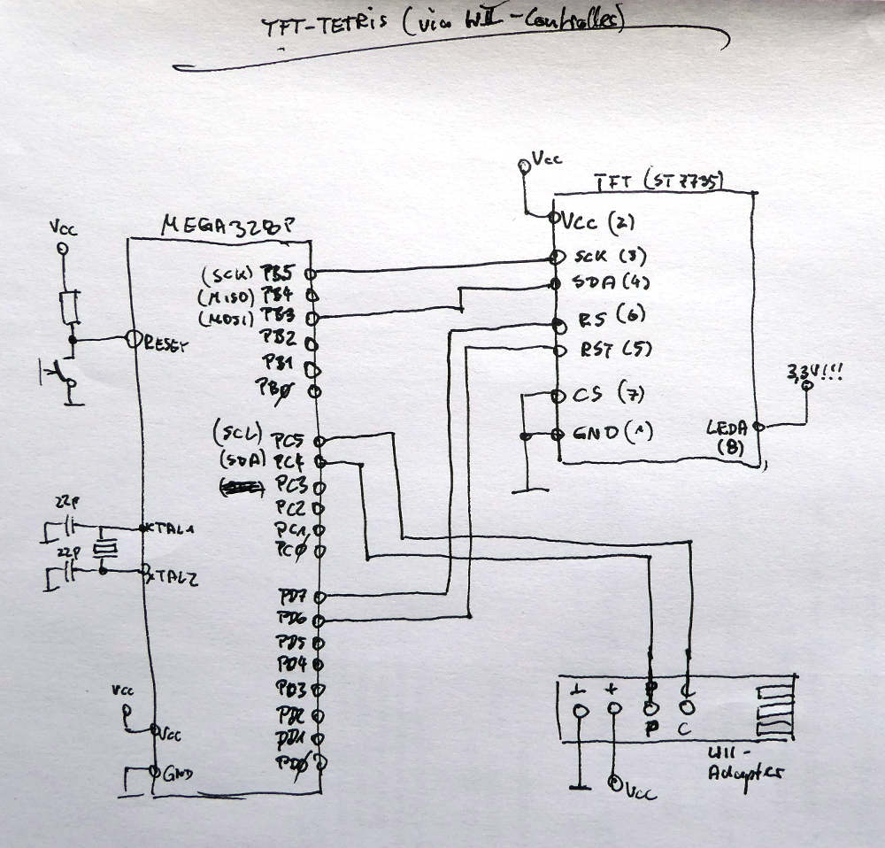
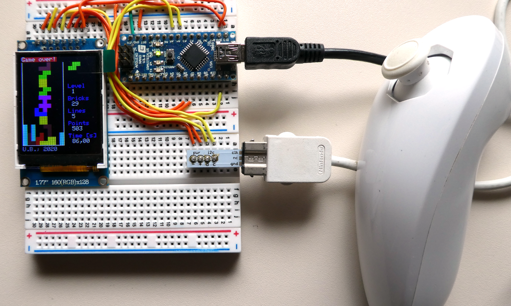

# Tetris-Konsole --> Steuerung via Wii-Nunchuck

Der Wii-Controller ist ja bekanntlich via TWI erreichbar/abfragbar. Irgendwann hatte ich mal eine [entsprechende Bibliothek](https://github.com/boerge42/wii_controller) geschrieben.

Schaltplan:

Aufbau auf einem Breadboard (und einem Arduino Nano; ...Mega328P):

---------
Have fun!

Uwe Berger; 2020